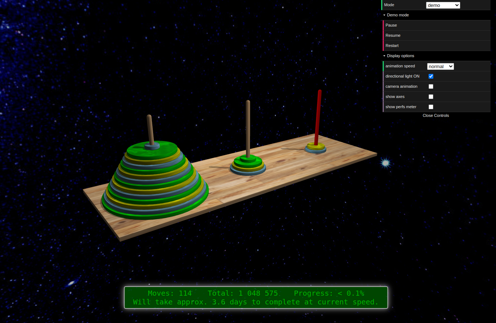

# Hanoï Towers 3D demonstrator



A configurable 3D animated demonstrator of the famous Hanoï Towers game.

The implementation is pure JS and is based on [ThreeJS](https://threejs.org/).

## Usage

### Project initialization

```
$ make install-deps
```

### Docker image build

```
$ make image
```

### Si erreur de permission

```
$ sudo chmod 666 /var/run/docker.sock
```

### Local run

```
$ make start
```

### All actions list

```
$ make help

Available targets:

  bundle               bundles the JS application
  clean-all            cleans all
  clean-build          cleanup build artefacts
  clean-deps           cleanup development dependencies
  help                 show this help
  image                builds the Docker image
  install-deps         installs development dependencies
  start                starts the image locally
  stop                 stops the local application

```
